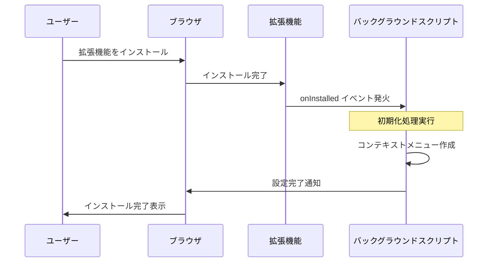
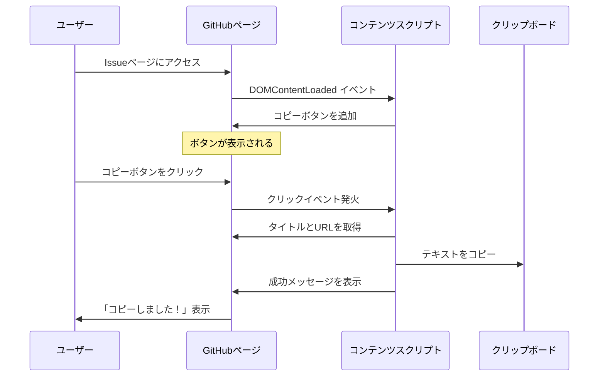
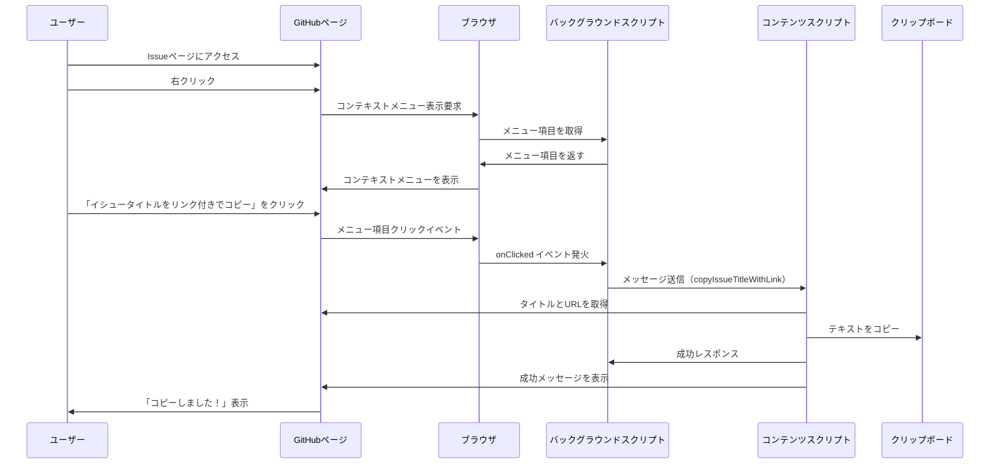
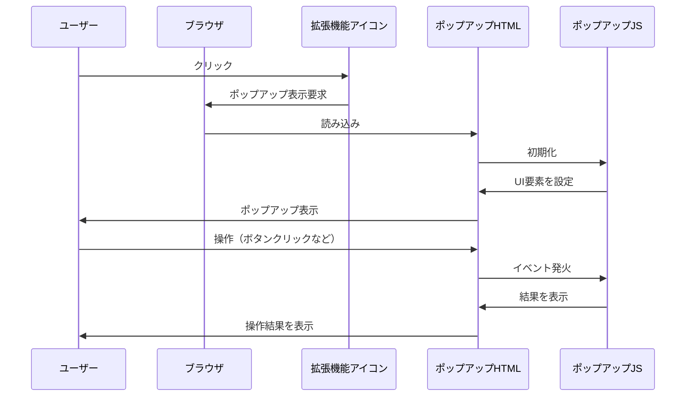
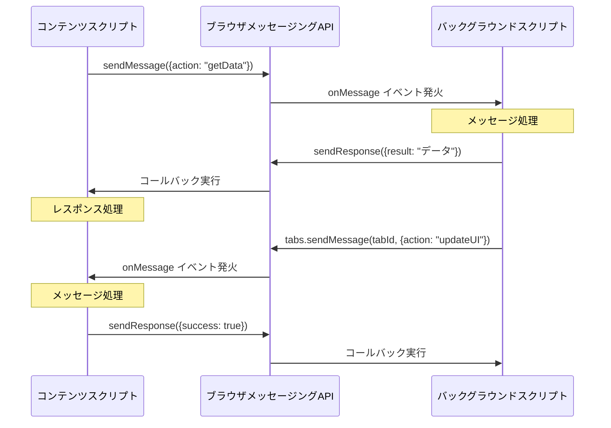
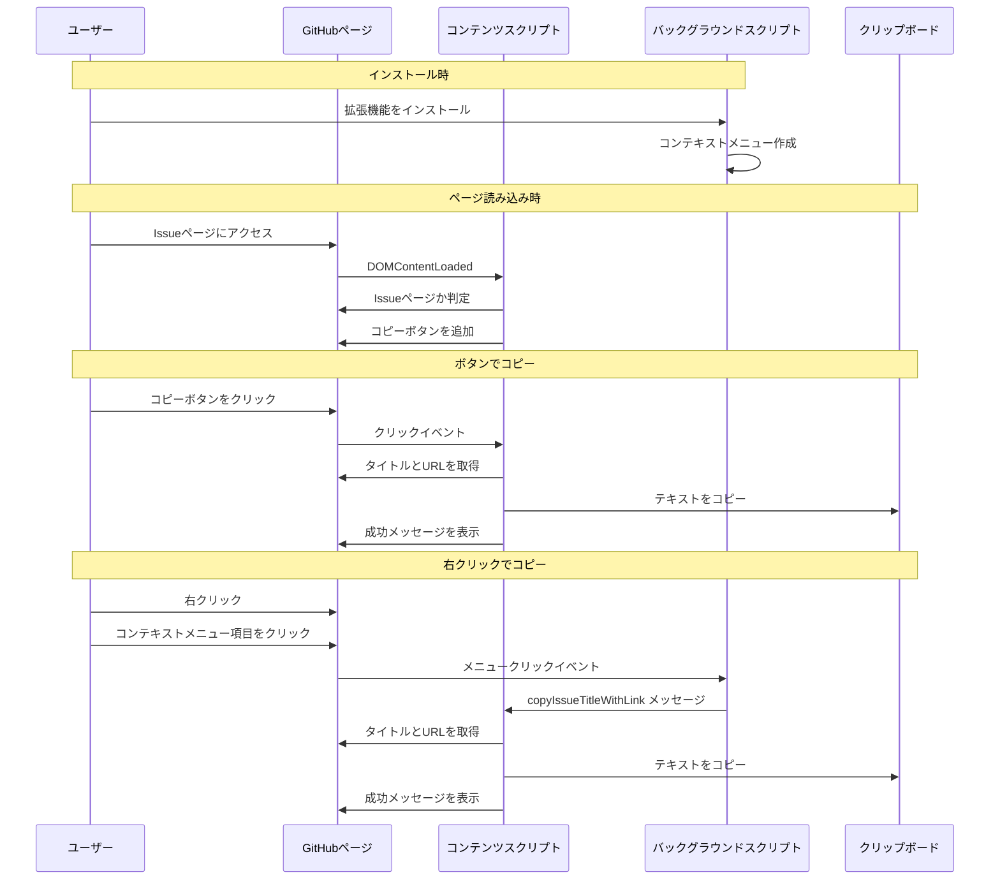

# Chrome拡張機能の処理フロー（シーケンス図）

このドキュメントでは、Chrome拡張機能の主要な処理フローをシーケンス図で説明します。

## 1. 拡張機能のインストール時の処理

## 2. ページ上のボタンからコピーする場合

## 3. 右クリックメニューからコピーする場合

## 4. 拡張機能のアイコンからポップアップを表示する場合

## 5. コンテンツスクリプトとバックグラウンドスクリプト間の通信

## 6. GitHub Issue Copierの全体的な処理フロー

